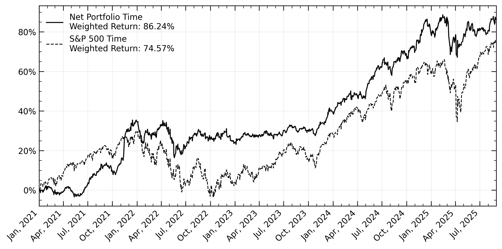

# Portfolio Tracker
Python code for tracking investment portfolio returns based on a given transaction history. Currently supports tracking of whole portfolio value and time weighted return to easier compare portfolio performance to a benchmark.

Requires transaction history in a specific .tsv format. An example transaction history file is provided in `transaction-files/transactions-history-example.tsv`

#### Notes
Required python modules are listed in `packages.txt`.

*** Issue with pandas_datareader so have to rewrite this to just use yfinance

## Examples

#### Portfolio Value

#### Time Weighted Portfolio Returns

